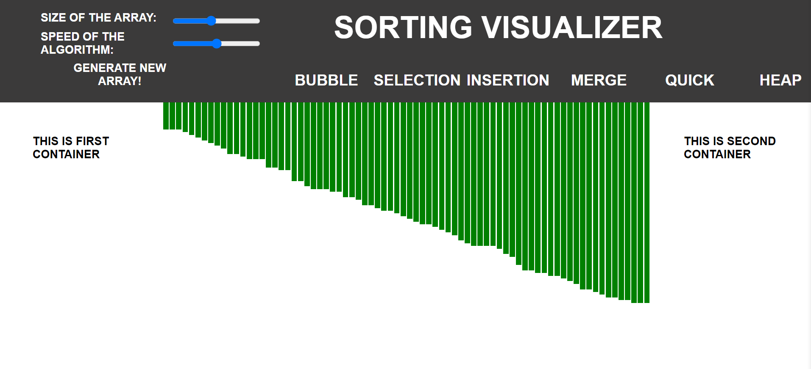

# Sorting Visualizer

## Welcome to Sorting Visualizer! 

#### This application is build because I was fascinated by sorting algorithms, and I wanted to visualize them in action.

#### This project is a Web Visualization tool for sorting algorithms like :

#### 1. Bubble Sort
#### 2. Selection Sort
#### 3. Insertion Sort
#### 4. Merge Sort
#### 5. Quick Sort
#### 6. Heap Sort

#### In this, we can change the size of array and control the visualization speed.

## AppPreview 

### Initial Preview (Before Sorting)

  

### While Sorting

  

### After Sorting

  

